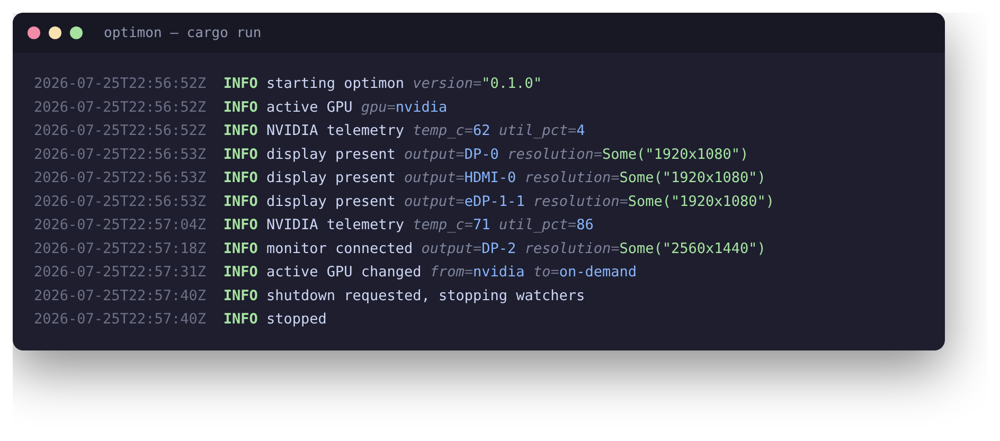

# optimon

A small concurrent monitoring daemon for NVIDIA Optimus laptops on Linux.

optimon runs independent [Tokio](https://tokio.rs/) tasks that poll GPU and
display state and emit structured [`tracing`](https://docs.rs/tracing) logs
**only when something meaningful changes** — a PRIME GPU switch, a significant
temperature or utilization move, or a monitor being connected or disconnected.
Steady state is silent.

> **Status:** v0.1 — solid monitoring and logging. Automated responses (e.g.
> re-running `autorandr` on display changes) are planned; see
> [`src/action.rs`](src/action.rs).

*Illustrative output — the startup lines are a real capture; the telemetry
spike, monitor-connect, and GPU-switch lines show what change events look like.*

## What it watches

| Watcher | Source | Logs when |
| --- | --- | --- |
| Active GPU | `prime-select query` | the system switches between `intel`, `nvidia`, and `on-demand` |
| NVIDIA telemetry | NVML (falls back to `nvidia-smi`) | temperature or utilization moves past a configurable threshold |
| Displays | `xrandr --query` | a monitor is connected, disconnected, or changes resolution |

Each watcher keeps a private in-memory snapshot of the last observed state, so
it only logs on an actual change rather than on every poll.

NVML is used when available; if it can't initialize, telemetry falls back to
shelling out to `nvidia-smi`. If the dGPU is powered down under PRIME, telemetry
is simply skipped until it returns.

## License

MIT
